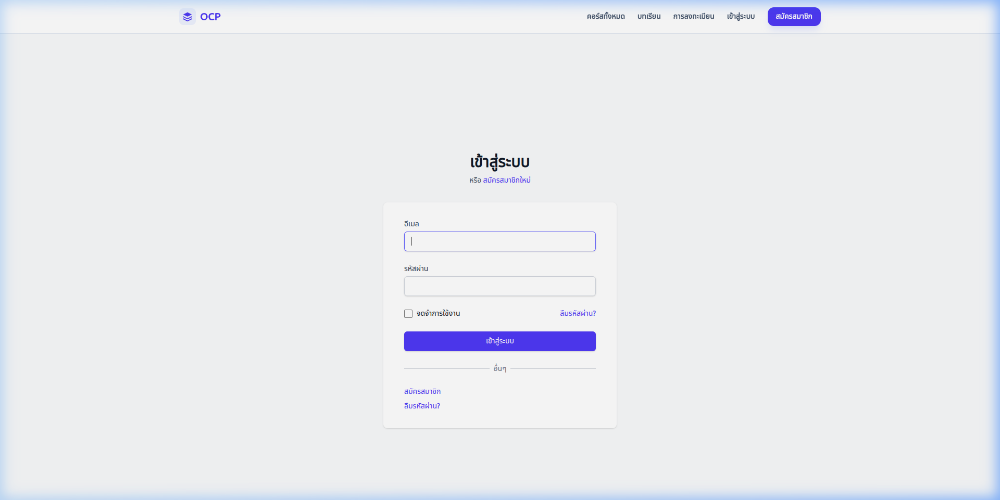

# 🎓 Online Course Platform (OCP)

ระบบจัดการคอร์สเรียนออนไลน์แบบครบวงจร พัฒนาด้วย Ruby on Rails 8.1.3 




## 🌟 ฟีเจอร์หลัก (Key Features)

- **ระบบจัดการคอร์สเรียน (Course Management):** สร้าง แก้ไข และจัดการเนื้อหาคอร์สเรียนได้อย่างง่ายดาย
- **บทเรียนและสื่อมัลติมีเดีย (Lessons & Media):** รองรับบทเรียนรูปเแบบวิดีโอ (YouTube integration) 
- **ระบบแบบทดสอบ (Quiz System):** ทดสอบความรู้หลังเรียนด้วยระบบ Quiz ที่บันทึกคะแนนและประวัติการสอบ
- **การจัดการบทบาทผู้ใช้ (Role-based Access Control):** 
  - **Admin:** ดูแลภาพรวมระบบและจัดการผู้ใช้
  - **Instructor:** สร้างและจัดการคอร์สเรียนของตนเอง
  - **Student:** ลงทะเบียนเรียนและทำแบบทดสอบ
- **ระบบกู้คืนข้อมูล (Soft Deletes & Restore):** ป้องกันข้อมูลสูญหายด้วยระบบ Paranoia และ PaperTrail สำหรับตรวจสอบประวัติการแก้ไข

## 🛠 เทคโนโลยีที่ใช้ (Tech Stack)

- **Backend:** Ruby on Rails 8.1.3
- **Frontend:** Tailwind CSS (Modern & Utility-first)
- **Database:** SQLite3
- **Authentication:** Devise
- **Authorization:** CanCanCan & Rolify
- **Asset Pipeline:** Propshaft & Importmap
- **Auditing:** PaperTrail & Paranoia

## 🚀 การติดตั้งและเริ่มใช้งาน (Installation & Setup)

### 1. โคลนโปรเจกต์
```bash
git clone [repository-url]
cd Online-Course-Platform
```

### 2. ติดตั้ง Dependencies
```bash
bundle install
```

### 3. เตรียมฐานข้อมูลและข้อมูลสาธิต (Seed Data)
```bash
bin/rails db:prepare db:seed
```

### 4. รันระบบในโหมด Development
```bash
bin/dev
```
ระบบจะเปิดใช้งานที่ `http://localhost:3000`

## 👤 บัญชีผู้ใช้สำหรับทดสอบ (Demo Accounts)

ทุกบัญชีใช้รหัสผ่านเดียวกันคือ: `password123`

| บทบาท (Role) | อีเมล (Email) |
| :--- | :--- |
| **Admin** | `admin@example.com` |
| **Instructor** | `teacher@example.com` |
| **Student** | `student@example.com` |

---
